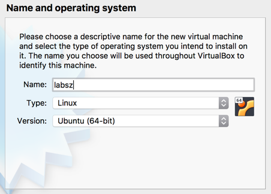
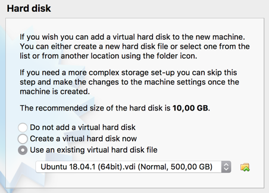
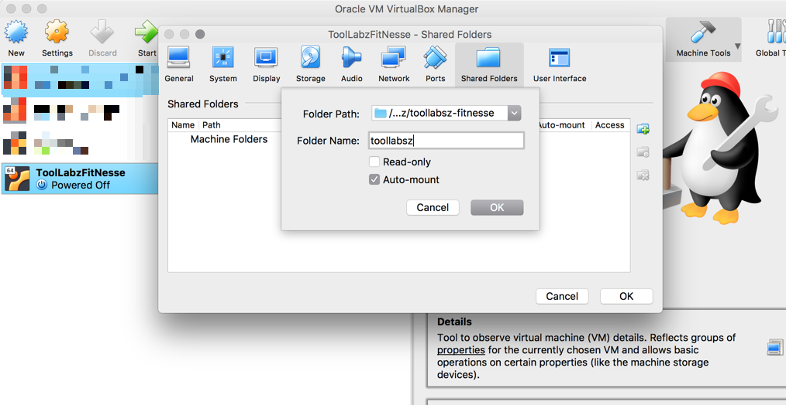

     ____             _                
    |  _ \           | |               
    | |_) | __ _ _ __| |_ ___  ___ ____
    |  _ < / _` | '__| __/ _ \/ __|_  /
    | |_) | (_| | |  | || (_) \__ \/ / 
    |____/ \__,_|_|   \__\___/|___/___|
    |__   __|        | | |         | |            
       | | ___   ___ | | |     __ _| |__  ___ ____
       | |/ _ \ / _ \| | |    / _` | '_ \/ __|_  /
       | | (_) | (_) | | |___| (_| | |_) \__ \/ / 
       |_|\___/ \___/|_|______\__,_|_.__/|___/___|
                                                
## Genereren virtuele machine

Benodigdheden: Virtualbox (https://www.virtualbox.org) en een internetverbinding.

* Installeer Virtualbox voor je eigen OS
    * https://www.virtualbox.org/wiki/Downloads
* Download een Ubuntu Virtuele machine van https://www.osboxes.org 
    * deze ToolLabsz gebruikt Ubuntu 19.04 Disco Dingo  https://www.osboxes.org/ubuntu/
    * pak het file uit, je hebt het vdi file nodig
* Start Virtualbox, maak een nieuwe Virtual Machine aan, pas eventueel het beschikbare geheugen aan en gebruik het uitgepakte file als disk

* maak een shared folder aan met deze repo als bron
    * dit wordt gebruikt om de tool, scripts en documentatie binnen de virtuele machine beschikbaar te hebben
    * voordat de vm als appliance wordt geexporteerd moet je deze shared folder verwijderen

* Start de VM, het wachtwoord voor deze VM is osboxes.org
* Installeer VirtualBox Guest Additions (hiermee wordt gedeeld klembord bijvoorbeeld mogelijk) en herstart

* Gebruik het meegeleverde setup script om de VM in te richten (uitvoeren als super user)
    * als je zelf een vm wil inrichten zorg je voor:
        * een script om de vm verder aan te passen
        * de tool die je wil gebruiken in een werkend project
    * uitvoer via
    
    sudo su && cd /media/sf_toollabsz/scripts/ && chmod +x setup.sh
    ./setup.sh

Het script voor deze tool lab heeft de volgende stappen:

echo "Update system"
apt-get update -y

echo "Installeer openjdk"
apt-get install openjdk-$JDK_VERSION-jdk -y

echo "Download en installeer RED Editor"
cd /tmp
wget https://github.com/nokia/RED/releases/download/$RED_VERSION/RED_Product_$RED_VERSION.deb
apt-get install ./RED_Product_$RED_VERSION.deb -y

echo "Installeer Robotframework en libraries"
apt-get install python3-pip python3-tk -y
pip3 install robotframework robotframework-seleniumlibrary RESTinstance

echo "Installeer Chrome"
apt-get install -y unzip xvfb libxi6 libgconf-2-4 curl
curl -sS -o - https://dl-ssl.google.com/linux/linux_signing_key.pub | apt-key add
echo "deb [arch=amd64]  http://dl.google.com/linux/chrome/deb/ stable main" >> /etc/apt/sources.list.d/google-chrome.list
apt-get -y update
apt-get -y install google-chrome-stable
echo "Bepaal versie Chromedriver en installeer"
VERSION=$(google-chrome --version)
VERSION=$(echo $VERSION| cut -d' ' -f 3)
VERSION=$(echo "${VERSION%.*}")
wget https://chromedriver.storage.googleapis.com/LATEST_RELEASE_$VERSION
VERSION=$(cat LATEST_RELEASE_$VERSION)
wget https://chromedriver.storage.googleapis.com/$VERSION/chromedriver_linux64.zip
unzip chromedriver_linux64.zip
mv chromedriver /usr/bin/chromedriver
chown root:root /usr/bin/chromedriver
chmod +x /usr/bin/chromedriver
echo "Installeer Geckodriver"
wget https://github.com/mozilla/geckodriver/releases/download/v0.24.0/geckodriver-v0.24.0-linux64.tar.gz
tar xvzf geckodriver-v0.24.0-linux64.tar.gz
mv geckodriver /usr/bin/geckodriver
chown root:root /usr/bin/geckodriver
chmod +x /usr/bin/geckodriver

echo "Installeer git"
apt-get install -y git-core

echo "Oefeningen naar vm kopieren"
mkdir /home/osboxes/workspace
cp /media/toollabsz/RFtraining /home/osboxes/workspace/RFtraining -R
chown osboxes:osboxes /home/osboxes/workspace -R
